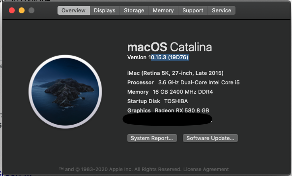

## MSI B250I GAMING PRO AC  Pentium G4600  Hackintoshi/Clover  EFI

HD630 from Pentium G4600 doesn't support working alone, need another descrited GPU.

## 配置/config

- CPU: Intel Pentium G4600
- 主板/MOB: MSI B250I GAMING PRO AC
- 内存/MEM: Crucial Ballistix Sport LT 3200 MHz DDR4 16GB (8GBx2) CL16
- 硬盘/HDD: Seagate 2TB + Toshiba SSD 120GB
- 显卡/GPU: MSI RX580 8GB
- 显示器/Monitor: HP 22er   1080P
- USB Audio: Behringer UMC22 2x2 USB Audio Interface
- WebCam: Logitech G920

## 正常使用/working

- MacOS 10.15.3 (19D76)
- USB audio interface works out of box
- Webcam works

## 问题

- has no working BT and WIFI

